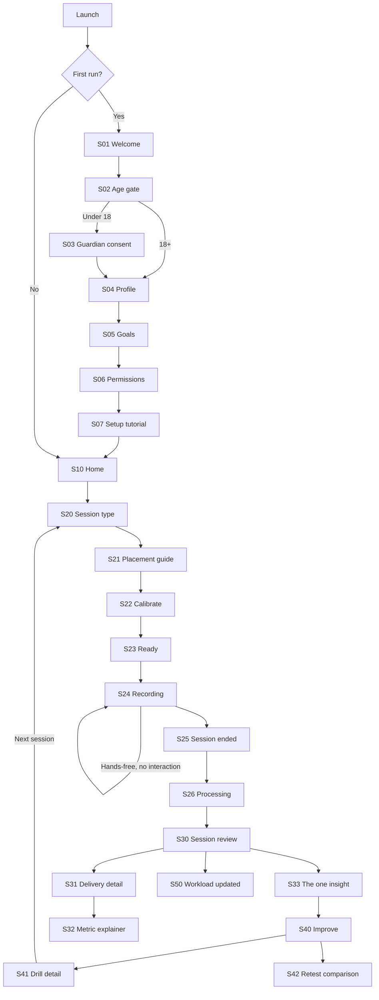

# Screen Flow Specification
## Consumer bowling biomechanics app — mobile UX

**Version:** 0.1 draft · **Date:** 17 August 2026 · **Platform:** iOS and Android (React Native/Expo)
**Companion to:** Business Case — Consumer Bowling Biomechanics App
**Scope:** Interaction model, screen inventory, flow specifications and state handling for the Gate 2 MVP and the season-one release. Visual design (palette, type, motion) is deliberately out of scope — this document specifies *behaviour and sequence*, not appearance.

---

## 1. The governing constraint

Most mobile apps assume the phone is in the user's hand. **This one is used almost entirely with the phone on a tripod, 20+ metres away, while the user's hands hold a cricket ball.**

That single fact invalidates the standard consumer-app interaction model and drives nearly every decision below:

| Reality of the net session | Design consequence |
|---|---|
| The phone is out of reach for the whole session | Zero required interaction between "start" and "stop". Everything is armed beforehand and reviewed afterwards |
| The user is 20 m away and moving | Recording state must be readable at distance — full-screen colour blocks, not a red dot. Audio confirmation is the primary feedback channel |
| A session is 4–6 overs, 24–40 deliveries | **The session is the unit of interaction, not the delivery.** Per-ball review is a review-time activity, never a capture-time one |
| Bright sun, sweat, dirt, occasionally gloves | Maximum contrast, large targets, near-zero text entry outdoors |
| 240fps capture plus on-device inference | Thermal and battery limits are a first-class design constraint, surfaced honestly in UI |
| Nets have poor connectivity; grounds often have none | Offline-first. Capture, processing and review must fully work in aeroplane mode |
| Sessions are social — mates, coach, teammates | Review is often shoulder-to-shoulder with someone else. Detail screens must be explainable, not just readable |

**The resulting rhythm:** *arm at the phone → bowl a spell hands-free → walk back and review a batch.* Every flow in this document serves that rhythm.

## 2. Design principles

1. **One insight per session.** The analysis surfaces a single biggest opportunity, not a dashboard of nine metrics. Depth is available on demand, never in the way. A bowler cannot act on five technique changes at once, and the research base (front knee, run-up speed, arm delay, trunk flexion) is small enough to work through one at a time.
2. **Never break the aha.** First capture through to first speed number and first insight is the product's entire conversion event. It is never gated, interrupted, rated-prompted or upsold.
3. **Show the working.** Every metric links to what it measures, why it matters, and the research behind it. This is the honesty positioning from the business case rendered as UI — and the defence against the credibility risk that has already bitten a competitor.
4. **Measurement humility in the interface.** Speed shows an error band, not a false-precision decimal. Low-confidence deliveries are marked, not silently included.
5. **Safety is structure, not a disclaimer.** Workload is a permanent navigation destination, not a settings toggle. For under-18 accounts it is the *default* home surface.
6. **Earn every notification.** Push is reserved for workload alerts, retest prompts and session-processing completion. Nothing else.
7. **Plain names for real things.** "Front knee at release", not "FKA@BR". "Bowl a session", not "New capture". Labels name what the bowler controls and recognises.

## 3. Navigation model

**Four-tab bottom bar, with capture as a persistent centre action.**

```
┌─────────────────────────────────────────────┐
│                                             │
│                CONTENT AREA                 │
│                                             │
├─────────────────────────────────────────────┤
│   Home      Improve    ( ● )    Load   You  │
│                       BOWL                  │
└─────────────────────────────────────────────┘
```

| Destination | Purpose | Why it earns a tab |
|---|---|---|
| **Home** | Current pace, trend, next action, recent sessions | The returning-user landing surface |
| **Improve** | Prescribed drill, drill library, retest prompts | The intervention half of the measure→intervene→verify loop; separating it prevents analysis becoming the whole product |
| **● Bowl** | Capture entry point | The core action. Centre, oversized, reachable one-handed at the top of a run-up |
| **Load** | Workload ledger, spell tracking, limits, rest guidance | Principle 5. Promoted to root navigation deliberately |
| **You** | Profile, subscription, linked accounts, data controls | Standard |

**Rejected alternative:** a hamburger drawer. Discoverability of the workload ledger matters too much to bury it, and the parent-facing trust argument depends on that feature being visible without being sought.

**Modal contexts (outside the tab bar):** Capture (full-screen, tab bar hidden — it is a mode, not a place), Onboarding, Paywall, Delivery detail.

## 4. Screen inventory

| ID | Screen | Flow |
|---|---|---|
| **S01** | Welcome / value proposition | Onboarding |
| **S02** | Age gate | Onboarding |
| **S03** | Guardian consent handoff | Onboarding (minors) |
| **S04** | Bowler profile — name, arm, type, height, arm span | Onboarding |
| **S05** | Goal setting | Onboarding |
| **S06** | Permission priming (camera, storage, notifications) | Onboarding |
| **S07** | Setup tutorial — how to place the phone | Onboarding |
| **S10** | Home / dashboard | Home |
| **S11** | Session history list | Home |
| **S20** | Session type picker | Capture |
| **S21** | Placement guide — where to put the phone | Capture |
| **S22** | Framing and calibration — mark crease and stumps | Capture |
| **S23** | Ready / arm state | Capture |
| **S24** | Recording (distance-legible) | Capture |
| **S25** | Session ended — summary card | Capture |
| **S26** | Processing | Capture |
| **S30** | Session review — summary and delivery list | Review |
| **S31** | Delivery detail — video, skeleton, metrics | Review |
| **S32** | Metric explainer | Review |
| **S33** | The one insight — biggest opportunity | Review |
| **S40** | Improve home — current focus | Improve |
| **S41** | Drill detail | Improve |
| **S42** | Retest comparison — before/after | Improve |
| **S43** | Drill library | Improve |
| **S50** | Workload — week view | Load |
| **S51** | Workload — season view | Load |
| **S52** | Rest guidance | Load |
| **S60** | Progress — pace trend | Home/You |
| **S61** | Metric trends | Home/You |
| **S70** | Profile and settings | You |
| **S71** | Subscription management | You |
| **S72** | Linked accounts — coach, guardian | You |
| **S73** | Data and privacy controls | You |
| **S80** | Paywall | Cross-cutting |
| **S90** | Share sheet — highlight clip export | Cross-cutting |

## 5. Master flow



The loop closes at S41 → next session. That cycle — **measure, intervene, verify** — is the product; the navigation exists to make it turn quickly.

---

## 6. Flow specifications

### F1 — First run and onboarding

**Objective:** reach the first capture in under three minutes, with the anthropometric and safety data the model needs, and without demanding an account.

| Step | Screen | Detail |
|---|---|---|
| 1 | **S01 Welcome** | Single promise, one screen: what the app measures and what it will tell them. No carousel. Primary action *Get started*; secondary *I already have an account* |
| 2 | **S02 Age gate** | Date of birth, neutrally framed ("So we can set safe bowling limits") — never "are you over 18?", which teaches lying. This determines the entire downstream experience (see F7) |
| 3 | **S03 Guardian consent** | Under-18 only. Guardian email, consent flow completed on the guardian's own device. App remains in a restricted state until consent returns: capture and workload work, sharing and any public surface do not |
| 4 | **S04 Bowler profile** | Bowling arm, type (pace / fast-medium / medium / spin), height, arm span. Arm span is requested with an explanation — it correlates strongly with release speed, and being upfront that it is unchangeable sets honest expectations from minute one |
| 5 | **S05 Goals** | Optional. Current speed if known, target speed, and what they want to fix. Feeds the first insight's framing |
| 6 | **S06 Permissions** | Contextually primed, requested one at a time at the moment of need — camera before first capture, not at launch. Notifications deferred entirely until after the first session completes |
| 7 | **S07 Setup tutorial** | Illustrated: where to stand the tripod, side-on, what must be in frame. Ends with *Bowl your first session* |

**Account creation is deferred.** The first session is captured, processed and reviewed anonymously on-device. The account prompt appears only when the user wants something that requires it — cloud backup, sharing, or a second device. Registration walls before the aha moment are the single largest first-run drop-off cause in consumer apps and this product's aha is unusually strong, so it should be spent on retention rather than on collecting an email address.

### F2 — Capture (the crux)

**Objective:** hands-free capture of a full spell with no interaction from 20 metres, and no lost deliveries.

**S20 Session type.** Three options: *Net session* (default), *Match spell*, *Drill check* (a short, focused retest — see F4). Session type determines the workload weighting applied in F6, since match deliveries carry higher intensity than net deliveries.

**S21 Placement guide.** An illustrated diagram plus a live camera preview: phone side-on, level with the popping crease, roughly 8–10 m from the pitch, landscape, tripod at hip height. A live checklist validates as conditions are met:
- ☑ Landscape orientation
- ☑ Device level (accelerometer)
- ☐ Crease and stumps visible
- ☑ Sufficient light for 240fps

Failing checks stay visible with a plain-language fix ("Too dark for slow motion. Move to better light or the speed reading will be unreliable"), and the user can always proceed anyway — with the consequence stated, not hidden.

**S22 Framing and calibration.** The user taps two reference points on the preview — the popping crease line and the base of the stumps. Known pitch geometry (22 yd; 1.22 m crease) then calibrates the scene for run-up speed and ball-speed estimation. Calibration is remembered per venue by camera pose, so a returning user at their home nets skips this step entirely.

**S23 Ready.** The arming screen and the last touch of the session. It states plainly what happens next: a countdown, then walk to the mark and bowl. Options: countdown duration (default 30 s), audio confirmation on/off, and an estimated recording capacity given battery and thermal headroom ("Room for about 45 deliveries at 62% battery"). Primary action: *Arm and walk away*.

**S24 Recording — the distance-legible screen.** Designed to be read at 20 m in sunlight, so it carries almost nothing:
- **Full-screen colour state.** Green field = armed and recording. Amber = a problem (subject out of frame, overheating, storage low). Red = stopped. The colour *is* the interface; a bowler at their mark can read it in peripheral vision
- **Delivery counter** in the largest legible type the screen allows — the one number a bowler wants mid-spell
- **Audio confirmation** after each detected delivery: a soft tone plus optional spoken speed ("one two eight"). This is the primary feedback channel because it works when the screen doesn't — facing away, mid-follow-through, walking back to the mark
- **Nothing else.** No controls, no metrics, no live skeleton. Anything more cannot be read at distance and invites a wasted walk back

Delivery detection is automatic. If detection fails for 90 seconds while motion continues, the app switches to amber and announces the problem aloud rather than silently recording nothing — a silent failure costs the user an entire spell and is unrecoverable.

**S25 Session ended.** Triggered by tap on return, or automatically after 5 minutes of no detected delivery. Shows an immediate summary before any processing: deliveries counted, fastest, average. The user gets a number the instant they pick up the phone.

**S26 Processing.** On-device inference, progress by delivery. Backgroundable — the user can leave, and a notification announces completion. Honest about time and thermal state ("This warms the phone up; it's normal").

### F3 — Review

**Objective:** deliver one actionable insight, with unlimited depth available beneath it.

**S30 Session review.** Ordered by what a bowler actually wants, in order:
1. **Headline speed** — fastest and average, with error band ("128 ± 4 km/h"). Never a false-precision decimal
2. **Change since last session** — the verification half of the loop
3. **The one insight** (S33) as a prominent card
4. **Delivery list** — thumbnail, speed, confidence flag; fastest and slowest marked; tap for detail

**S31 Delivery detail.** Video with skeleton overlay, scrubbable, with frame-step at key events. Event markers on the scrubber for back-foot contact, front-foot contact and release. Metrics presented as a short list, each with the user's value, a research-derived reference range, and a one-line meaning:

> **Front knee at release — 148°**
> Reference for faster bowlers: >150°
> A braced, straight front leg converts run-up momentum into ball speed. Yours collapses slightly.

Each metric taps through to **S32 Metric explainer**: what it is, why it links to speed, how it is measured here, the measurement's limitations, and the research citation. Principle 3, made concrete.

**S33 The one insight.** A single screen: the biggest opportunity identified, why it was chosen ahead of others, the estimated speed available if it improves, and one primary action — *Start the drill* → S41. Explicitly not a list. If two limiters are close, the app picks the one that is safer and easier to change first, and says so.

### F4 — Improve

**Objective:** close the loop from insight to intervention to verified change.

**S40 Improve home.** Current focus (one limiter), the prescribed drill, progress against it, and a retest prompt when enough sessions have passed. Secondary access to **S43 Drill library**.

**S41 Drill detail.** Demonstration video, two or three cues in the bowler's language, prescribed reps, and — importantly — what *should* feel different when it is working. Ends with *Retest this in your next session*, which pre-configures a **Drill check** session type in F2.

**S42 Retest comparison.** Side-by-side video, before and after, synchronised at front-foot contact, with the metric delta and the speed delta. This screen is the product's proof of value and the most shareable artefact it produces — export runs through S90 with a watermark, feeding the organic acquisition engine the business case depends on.

### F5 — Progress

**S60 Pace trend** over time, annotated with drills started and retests passed, so cause and effect are visible rather than implied. **S61 Metric trends** for each determinant. Seasons are delimited; comparisons default to within-season, since off-season gaps make continuous lines misleading.

### F6 — Workload

**Objective:** make load management effortless and make the limits ambient rather than punitive.

**S50 Week view.** Deliveries by day, spells, current position against the applicable guideline (Cricket Australia's 1-3-5 rule under 17, 2-4-6 for 17–19, ECB equivalents by territory), and a plain status: *Good to bowl*, *Bowl light*, or *Rest today*. Rolling 7-day load is shown alongside the daily count, since the research associates the 7-day peak with injury risk more strongly than any single day.

**S51 Season view.** Long-run load, with ramp rate flagged — sudden increases after a break are a documented risk factor and are exactly what a bowler chasing pace will do.

**S52 Rest guidance.** Reached from an amber or red status. Explains the reason in one paragraph, gives the recommendation, and offers non-bowling work that still serves the current drill focus. Never scolds, and never blocks the user from bowling — the app advises, the human decides.

Workload accrues automatically from captured sessions and can be added manually for uncaptured ones, because a ledger that only counts filmed deliveries is worse than useless.

### F7 — Junior and guardian mode

Triggered by the S02 age gate for under-18 accounts. The differences are structural, not cosmetic:

| Element | Adult account | Under-18 account |
|---|---|---|
| Home surface | Pace trend | **Workload status first**, pace second |
| Leaderboards, challenges, streaks | Available | **Absent.** No mechanic that rewards bowling more, faster, or on consecutive days |
| Speed goals | User-set, unrestricted | Framed alongside load; no "personal best" push notifications |
| Sharing | Full | Off by default; guardian-controlled |
| Guardian view | n/a | **S72** — linked read-only access to workload, alerts on limit breaches, no access to the child's video by default |
| Mixed-action screening | Available | **Surfaced proactively**, with a recommendation to see a qualified coach or physiotherapist |
| Data retention | Standard | Minimised; on-device only unless the guardian opts in |

The commercial logic matches the ethical logic: the parent is a payer, and what a parent buys is confidence that their child is being looked after. The safeguards are the product's most defensible feature, not a tax on it.

### F8 — Subscription and paywall

**Free tier:** three analysed sessions per month, full speed log, complete workload ledger. The workload features are never gated — safety behind a paywall would be indefensible and would poison the parent segment.

**Pro tier:** unlimited analysis, full metric breakdown, retest comparisons, trends, drill library, export.

**Paywall placement (S80).** The wall sits at the *fourth* session of a month, never earlier, and never inside the first-run flow. The user must have completed the full loop — captured, reviewed, been given an insight, run the drill and seen a verified change — before being asked for money. Trigger points, in priority order:
1. Fourth session in a calendar month (primary)
2. Tapping a locked deep-metric view after the free allocation is used
3. Retest comparison export

The paywall states the annual price first, shows the monthly equivalent beneath it, and does not use a countdown timer. Annual retention is roughly 2.5× monthly per subscription benchmarks, so the entire pricing presentation should push annual — but by making it obviously better value, not by manufacturing urgency.

---

## 7. State and error handling

The capture flow's failure modes are unusually expensive: a silent failure costs a bowler an entire spell they cannot re-bowl, in a sport where deliveries are a finite weekly budget. Failures are therefore announced *aloud*, at the moment they occur, not discovered later.

| Condition | Detected at | Behaviour |
|---|---|---|
| Too dark for 240fps | S21 | Warn with a fix; allow override; mark affected deliveries low-confidence |
| Crease or stumps not visible | S21/S22 | Block calibration; offer manual pitch-length entry as fallback |
| Bowler out of frame mid-session | S24 | Amber state + spoken alert within one delivery |
| No delivery detected for 90 s with motion present | S24 | Amber + spoken alert; likely framing or angle problem |
| Device overheating | S24 | Amber + spoken alert; drop to a lower capture rate rather than stopping; explain the trade-off at review |
| Storage low | S23 (pre-flight) and S24 | Pre-flight estimate of capacity; mid-session warning at a 5-delivery buffer |
| Battery below 20% | S23 | Pre-flight warning with realistic delivery capacity |
| Processing interrupted | S26 | Resume on relaunch; never lose captured footage |
| Speed estimate outside plausible range | S26 | Flag as low-confidence, exclude from trend, show the raw video |
| Offline | Any | Full function. Sync queues silently; no blocking spinners |
| Guardian consent pending | Any | Capture and workload work; sharing and export do not |

**Empty states** are entry points, not apologies. Home with no sessions shows what the first one will produce and a single action. Improve with no analysis explains that a session comes first. Workload with no data offers manual entry.

## 8. Accessibility and field conditions

- **Contrast:** the recording state must be legible in direct sunlight at 20 m; specify against outdoor luminance, not the standard 4.5:1 indoor ratio
- **Targets:** 60×60 pt minimum for anything touched outdoors — bigger than the platform 44 pt guidance, because the user is standing, hot and hurried
- **Audio-first capture:** every capture-state change has a distinct sound. The full session is operable by ear alone, which serves both the 22-yard problem and blind or low-vision users
- **Text entry:** none required outdoors. All setup uses taps or selection
- **One-handed:** all pre-capture screens operable in the lower two-thirds of the display, holding a ball in the other hand
- **Motion:** reduced-motion honoured; no animation carries information alone
- **Language:** metric and imperial, with km/h and mph selectable — the UK market matters commercially and uses mph

## 9. Instrumentation

The flows above should emit exactly the events needed to answer the business case's Gate 2 questions, and few others:

| Question from the business case | Event chain |
|---|---|
| Does the aha land? | `onboarding_complete` → `first_capture_started` → `first_insight_viewed` (target: >60% within 7 days) |
| Does the loop close? | `insight_viewed` → `drill_started` → `retest_completed` (the single most important funnel in the product) |
| Where does capture fail? | State-transition events across S21–S26, with failure reason |
| Is the speed metric credible? | `low_confidence_flagged` rate; radar-comparison deltas during beta |
| Does the paywall sit right? | `paywall_shown` by trigger, with conversion by trigger type |
| Week-4 retention (Gate 2 pass criterion: ≥40%) | `session_captured` cohorted by signup week |

## 10. MVP scope line

For Gate 2 — a 30-bowler closed beta over one season, built solo — the following is **in**:

S01–S07 onboarding · S10 Home · S20–S26 capture · S30–S33 review · S40–S41 drills (a small hand-authored set, one per determinant) · S50 workload week view · S70 profile.

**Deferred past the beta:** drill library breadth (S43), season workload view (S51), metric trends (S61), coach linking (S72), sharing and export (S90), retest comparison (S42 — desirable but not required to test the core loop), and the paywall itself (beta is free; willingness to pay is tested by interview and pre-order per the Gate 2 criteria).

**Non-negotiable in the MVP despite the scope pressure:** the age gate (S02), guardian consent (S03), the workload ledger (S50), and confidence flagging on speed estimates. Those four are the product's ethical floor, and retrofitting them later means retrofitting them onto real minors' data.

## 11. Open questions to prototype

Things this specification asserts but has not proven, in rough order of risk:

1. **Is audio confirmation actually audible at 20 m** in wind, with nets, other players and traffic? If not, the whole hands-free model needs a rethink — a paired smartwatch as the feedback channel is the leading alternative
2. **Can two-point calibration survive being done by a hurried user in bright sun,** or does it need automatic crease detection to be usable?
3. **What is the real thermal ceiling?** If a phone can only sustain 20 deliveries of 240fps capture plus inference, the session model changes fundamentally — possibly to capture-now, process-later overnight on charge
4. **Does the delivery counter alone satisfy mid-session curiosity,** or do bowlers walk back to check speeds and break the flow? Worth testing both with and without spoken speed
5. **Is "the one insight" too austere?** Some users will feel short-changed by a single recommendation. Test against a two-or-three variant, but resist the dashboard
6. **Does the drill-check session type get used,** or do people simply bowl a normal session and hope? The retest is the verification half of the loop; if it is skipped, the loop does not close and the product is just a speed gun with extra steps
